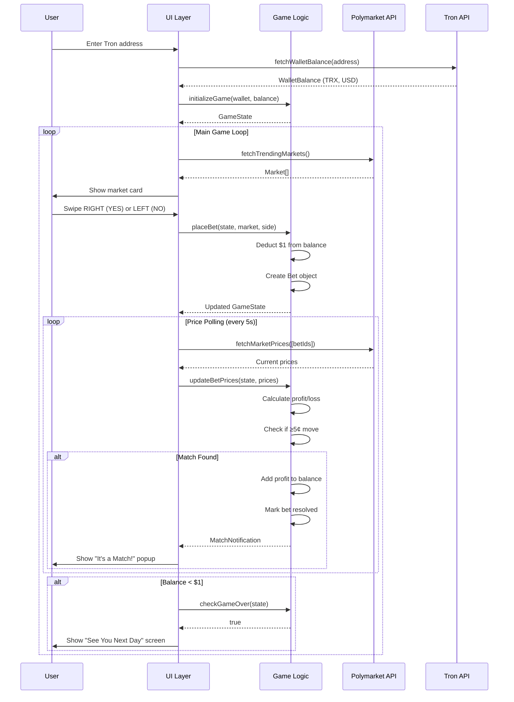
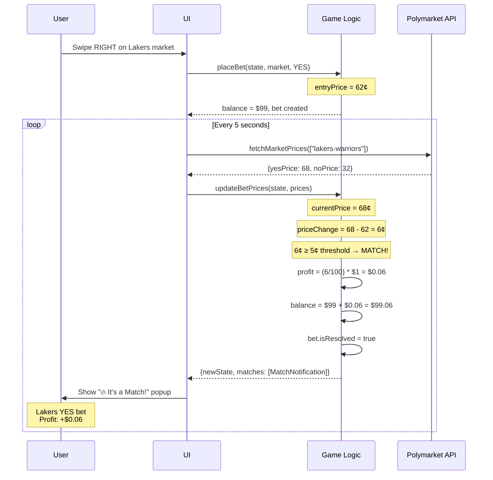
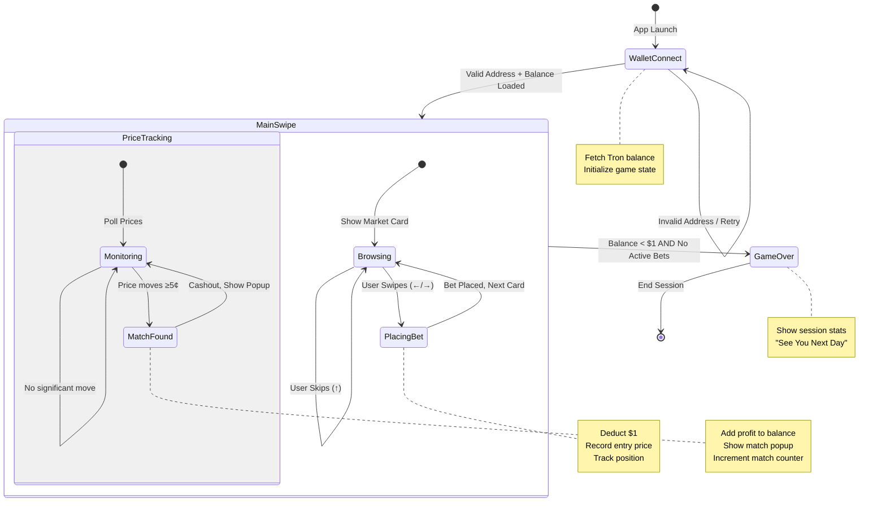
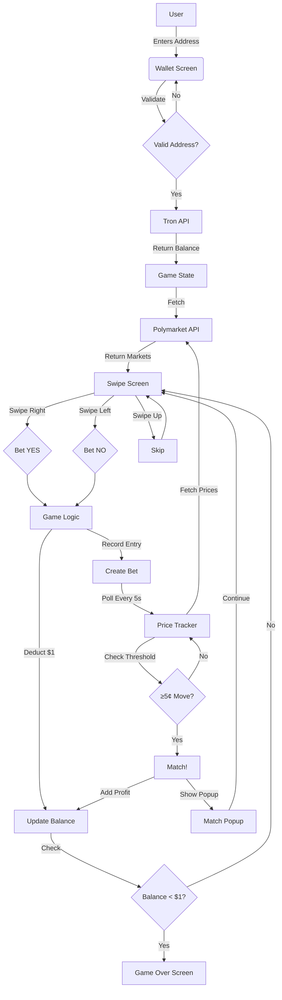

# PolyMatch UML Diagrams

## Class Diagram

```mermaid
classDiagram
    class Market {
        +string id
        +string title
        +string category
        +number endDate
        +number yesPrice
        +number noPrice
        +number volume
        +string emoji
        +string url
    }

    class Bet {
        +string id
        +string marketId
        +string marketTitle
        +string marketEmoji
        +boolean side
        +number entryPrice
        +number amount
        +number timestamp
        +number currentPrice
        +boolean isResolved
        +number profitLoss
    }

    class WalletBalance {
        +string address
        +number trx
        +number usdValue
        +number lastUpdated
    }

    class GameState {
        +number balance
        +number startingBalance
        +Bet[] bets
        +Bet[] resolvedBets
        +number totalBets
        +number totalMatches
        +boolean isGameOver
        +string walletAddress
    }

    class MatchNotification {
        +Bet bet
        +number priceChange
        +number profit
        +number timestamp
    }

    class PolymarketAPI {
        +fetchTrendingMarkets() Market[]
        +fetchMarketPrice() number
        +fetchMarketPrices() Record
        +formatTimeRemaining() string
        +formatVolume() string
    }

    class TronAPI {
        +fetchWalletBalance() WalletBalance
        +isValidTronAddress() boolean
        +formatTrxBalance() string
        +formatUsdValue() string
    }

    class GameLogic {
        +createInitialState() GameState
        +initializeGame() GameState
        +placeBet() {newState, bet}
        +updateBetPrices() {newState, matches}
        +skipMarket() GameState
        +checkGameOver() boolean
        +getSessionStats() object
    }

    GameState "1" *-- "*" Bet : contains
    GameState "1" *-- "1" WalletBalance : initialized from
    MatchNotification "1" *-- "1" Bet : references
    PolymarketAPI ..> Market : returns
    TronAPI ..> WalletBalance : returns
    GameLogic ..> GameState : manages
    GameLogic ..> MatchNotification : emits
```

## Sequence Diagram: App Flow



## Sequence Diagram: Match Detection



## State Machine Diagram



## Component Diagram

```mermaid
componentDiagram
    component "UI Layer" as UI {
        component "WalletScreen" as WS
        component "SwipeScreen" as SS
        component "MatchPopup" as MP
        component "GameOverScreen" as GS
    }
    
    component "Game Logic" as GL {
        component "State Management" as SM
        component "Bet Engine" as BE
        component "Match Detector" as MD
    }
    
    component "API Layer" as API {
        component "Polymarket Client" as PM
        component "Tron Client" as TR
    }
    
    component "External Services" as EXT {
        database "Polymarket API" as POLY
        database "TronGrid API" as TRON
    }
    
    WS --> SM: Initialize game
    SS --> BE: Place bet on swipe
    SS --> PM: Fetch markets
    MP --> MD: Display match
    GS --> SM: Show stats
    
    SM --> TR: Fetch wallet balance
    BE --> PM: Fetch market prices
    MD --> PM: Poll for price changes
    
    PM --> POLY: HTTP requests
    TR --> TRON: HTTP requests
```

## Data Flow Diagram


